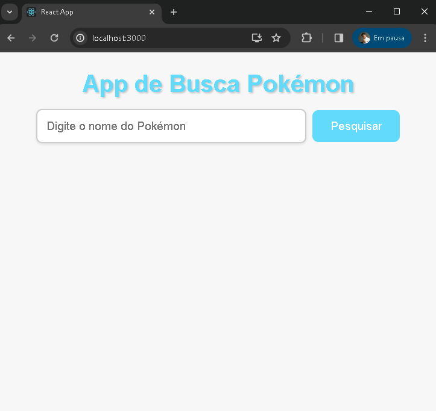

#  App de Busca Pokémon




## Descrição

O App de Busca Pokémon é uma aplicação web simples que permite aos usuários pesquisar informações sobre Pokémon. Ele utiliza a [PokeAPI](https://pokeapi.co/) para obter detalhes sobre Pokémon com base em seus nomes.

## Funcionalidades

- **Pesquisa de Pokémon:** Os usuários podem inserir o nome de um Pokémon na caixa de pesquisa e obter detalhes sobre ele.

- **Exibição de Informações:** A aplicação exibe informações, incluindo o nome do Pokémon, imagem, experiência base, movimentos, peso e altura.

- **Mostrar Todos/Menos Movimentos:** Os usuários têm a opção de mostrar todos os movimentos ou apenas os três primeiros.

## Tecnologias Utilizadas

- React: Uma biblioteca JavaScript para construção de interfaces de usuário.

- PokeAPI: Uma API gratuita para obter dados detalhados sobre Pokémon.

## Como Usar

1. Clone o repositório.

   ```bash
   git clone https://github.com/isaacbrunodev/pokemon-app.git

2. Instale as dependências.

cd pokemon-search-app

npm install

3. Inicie a aplicação
 
  npm start
